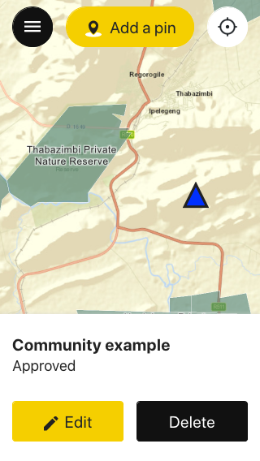

# covid-wildlife-tourism

Covid Wildlife Tourism Africa is an online platform that collects information about the communities and enterprises involved in wildlife tourism in Africa, and that have been impacted by the Covid-19 pandemic.

The application has been carefully designed and developed so it can run smoothly on high-latency and low-bandwidth mobile connections such as regular 2G and 3G connections.

The production instance of the application is found here: [map.resourceafrica.net](https://map.resourceafrica.net).

## Dependencies

- Ruby on Rails 6.0.2
- Ruby 2.6.3
- PostgreSQL 12
- PostGIS
- Node 12.16.1

## Setting up the project locally

1. Clone the repository
2. Install the Ruby dependencies: `bundle install`
3. Create and migrate the database: `rails db:create db:migrate`
4. Make sure you you have [Node.js](https://nodejs.org/en/) installed
5. (Optional) Install [NVM](https://github.com/nvm-sh/nvm) to manage your different Node.js versions
6. (Optional) Use [Visual Studio Code](https://code.visualstudio.com/) as a text editor to benefit from automatic type checking
7. Configure your text editor with the [Prettier](https://prettier.io/), [ESLint](https://eslint.org/) and [EditorConfig](https://editorconfig.org/) plugins
8. Use the correct Node.js version for this app by running `nvm use`; if you didn't install NVM (step 5), then manually install the Node.js version described in `.nvmrc`
9. Install the JS dependencies: `yarn`
10. Create a `.env` file at the root of the project by copying `.env.default` and giving a value for each of the variables
11. Start the server with `rails server`
12. Open your browser and visit `http://localhost:3000` and ta-da!
